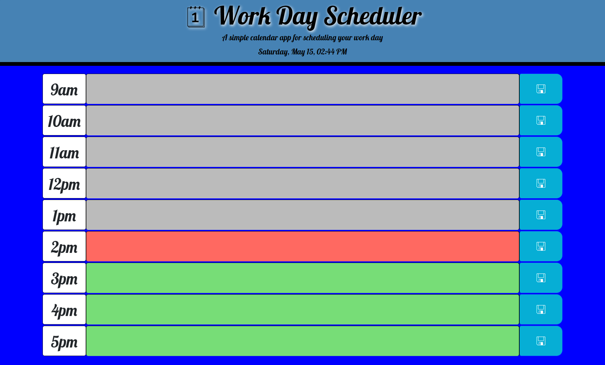

# Work_Day_Scheduler

## Description

The motivation for this project was to create a web page that you can see your work day schedule and save what you are going to do in that work hour. The reason for this project was to apply the knowledge learn with Third-Party APIs using javascrip with jQuery and luxon. I learn that for this work there alwasys a diffent way to get the same result or shorter way to get to the same answer, you just need to look for it a make it apply it to your project in a better way. 

## Usage

On the webpage you will see the current date and time on the head of the page and it will update the time every second to the current one. For the body you will see a row of timeblocks for standard business hours boxes with the time of your daily work from 9:00 am to 5:00 pm in the first colum, the middle colum is the test area where you will put your task for that time, and the last colum is the save button to the what is saved in the text area. The text area timeblock is color coded to indicate whether it is in the past, present, or future and it will update every second. When you click the save button the information will be saved in the local storage. Lastly when the page is refresh the saved information will persist.

## Links & Screenshots
 * [Work Day Scheduler Web Page](https://arielo5.github.io/Work_Day_Scheduler/)

 * Screenshots of the web pages

    

    

 ## Repo Content
* css (folder)
    * style.css
* images (folder)
* javascript (folder)
    * scrips.js 
* README.md
* index.html

## MIT License

Copyright (c) 2021 Ariel Martinez 

Permission is hereby granted, free of charge, to any person obtaining a copy
of this software and associated documentation files (the "Software"), to deal
in the Software without restriction, including without limitation the rights
to use, copy, modify, merge, publish, distribute, sublicense, and/or sell
copies of the Software, and to permit persons to whom the Software is
furnished to do so, subject to the following conditions:

The above copyright notice and this permission notice shall be included in all
copies or substantial portions of the Software.

THE SOFTWARE IS PROVIDED "AS IS", WITHOUT WARRANTY OF ANY KIND, EXPRESS OR
IMPLIED, INCLUDING BUT NOT LIMITED TO THE WARRANTIES OF MERCHANTABILITY,
FITNESS FOR A PARTICULAR PURPOSE AND NONINFRINGEMENT. IN NO EVENT SHALL THE
AUTHORS OR COPYRIGHT HOLDERS BE LIABLE FOR ANY CLAIM, DAMAGES OR OTHER
LIABILITY, WHETHER IN AN ACTION OF CONTRACT, TORT OR OTHERWISE, ARISING FROM,
OUT OF OR IN CONNECTION WITH THE SOFTWARE OR THE USE OR OTHER DEALINGS IN THE
SOFTWARE.
